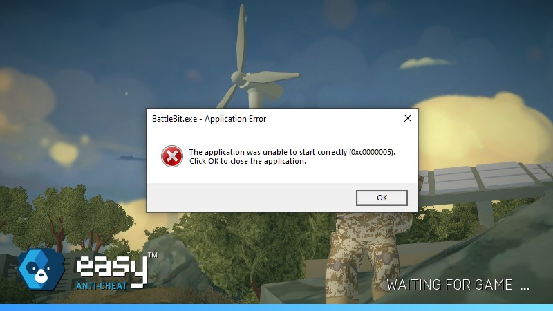
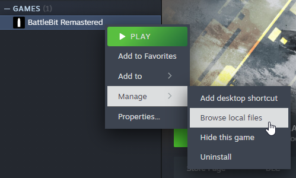
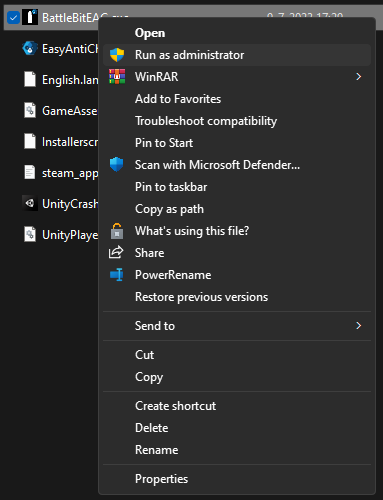

# The application was unable to start correctly (0xc0000005).

<figure><figcaption></figcaption></figure>

This error code means access violation => could be anything.

1. If you use third-party antivirus make sure it's not interfering with the game and add BattleBit and EAC folder to exclusions. If it won't help - delete it (especially trend micro).
2. Try running `BattlebitEAC.exe` or `EasyAntiCheat.exe` as admin located in installed files.

<figure><figcaption>
Right click on the game, then go to manage and click on Browse local files
</figcaption></figure>

<figure><figcaption>
Right click on executable and click "Run as administrator".
</figcaption></figure>

3. [Run sfc/dism](../other/running-sfc-dism.md).
4. Disable overclocking software if you have any.
5. Verify game files.

<figure><figcaption>
Right click on the game and press "Properties...", Select "Installed Files" tab and press "Verify integrity of game files".
</figcaption></figure>

6. Reinstall the game on other drive/partition.
