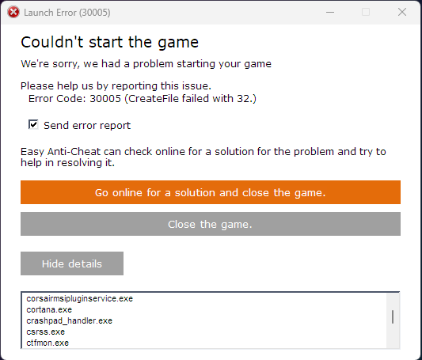

# 🔘 CreateFile failed with 32.

<figure><figcaption></figcaption></figure>

1. Reboot your PC.
2. Remove `EasyAntiCheat_EOS.sys` file located in `C:\Program Files (x86)\EasyAntiCheat_EOS`.
3. Run the [EAC Fix batch](https://github.com/livingflore/BattleBitEACFix) (download button).

