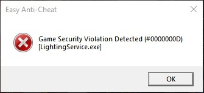

# 🔘 Game Violation Detected

<figure><figcaption></figcaption></figure>

If you see #0000000D error code, get rid of a process that interfere with EAC (its name in square brackets). For any other error codes, fixes are universal:

1. Check your task manager and get rid of any software that you think can interfere with EAC (RGB, tray minimizers, tweaks, etc).
2. If you use third-party antivirus - make sure to add EAC to exclusions. If it won't help - get rid of this antivirus.
3. Run the [EAC Fix batch](https://github.com/livingflore/BattleBitEACFix) (download button).
4. Try running `BattlebitEAC.exe` or `EasyAntiCheat.exe` as admin located in installed files.

<figure><figcaption>
Right click on the game, then go to manage and click on Browse local files
</figcaption></figure>

<figure><figcaption>
Right click on executable and click "Run as administrator".
</figcaption></figure>

5. Verify game files.

<figure><figcaption>
Right click on the game and press "Properties...", Select "Installed Files" tab and press "Verify integrity of game files".
</figcaption></figure>

5. Enable [Data Execution Prevention](https://support.microsoft.com/en-us/topic/what-is-data-execution-prevention-dep-60dabc2b-90db-45fc-9b18-512419135817).
6. Verify driver signatures.

<figure><figcaption>
Press Win+R, type <code>sigverif</code> and press enter.
</figcaption></figure>

<figure><figcaption>
Proceed with driver signature verification by pressing "Start".
</figcaption></figure>

&#x20;After its finished, you'll be prompted either with the list of unsigned drivers or message that everything's fine. In first case, depending on what drivers are unsigned, you may need to [reinstall](https://support.nzxt.com/hc/en-us/articles/4403882406555-Reinstalling-Graphic-Drivers)/update your GPU drivers or [run sfc/dism](../other/running-sfc-dism.md).
