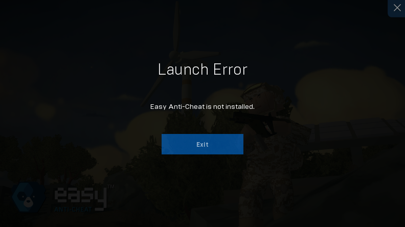
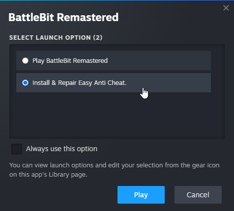
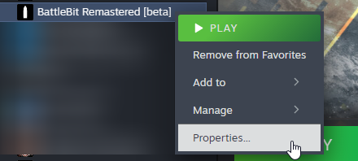

# 🔘 Launch Error - Easy Anti-Cheat is not installed

<figure><figcaption></figcaption></figure>

Run the ["Install & Repair Easy Anti Cheat"](https://i.imgur.com/466AXn8.png) launch option.

<figure><figcaption></figcaption></figure>

If you can't reach launch options, here's how you can bring it back:

<figure><figcaption>
Right click on the game and press "Properties..."
</figcaption></figure>

<figure><figcaption>
Select "General" tab and under "Launch Options" select "Ask when starting game".
</figcaption></figure>
