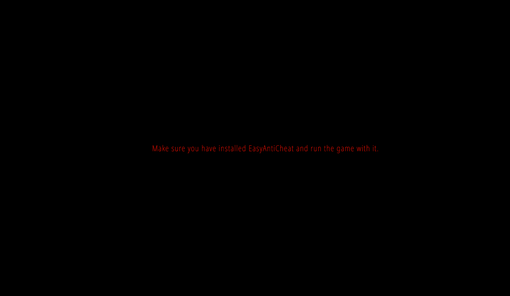

# 🔘 Make sure you have installed EasyAntiCheat and run the game with it.

<figure><figcaption></figcaption></figure>

1. Run the [EAC Fix batch](https://github.com/livingflore/BattleBitEACFix) (download button).
2. Ensure that **BOTH** VCRedists installed properly - [x86](https://aka.ms/vs/17/release/vc\_redist.x86.exe) and [x64](https://aka.ms/vs/17/release/vc\_redist.x64.exe). When running installers you should see 3 buttons - repair, uninstall and cancel as on screenshot below. If you can't see it - proceed with installation.

<figure><figcaption></figcaption></figure>

<figure><figcaption></figcaption></figure>

1. Try running `BattlebitEAC.exe` or `EasyAntiCheat.exe` as admin located in installed files.

<figure><figcaption>
Right click on the game, then go to manage and click on Browse local files
</figcaption></figure>

<figure><figcaption>
Right click on executable and click "Run as administrator".
</figcaption></figure>

4. You might experience some issues with connection and therefore EAC can't reach its servers. Try using [Cloudflare WARP](https://1.1.1.1) or any private VPN on this matter.\
