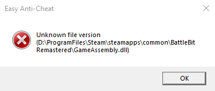

# 🔘 Unknown file version

<figure><figcaption></figcaption></figure>

1. Reboot your PC.
2. Verify game files.

<figure><figcaption>
Right click on the game and press "Properties...", Select "Installed Files" tab and press "Verify integrity of game files".
</figcaption></figure>
