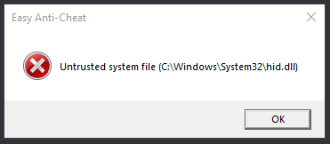

# 🔘 Untrusted System File

<figure><figcaption></figcaption></figure>

Depending on what driver causes this, you may need to [reinstall](https://support.nzxt.com/hc/en-us/articles/4403882406555-Reinstalling-Graphic-Drivers)/update your GPU drivers or [run sfc/dism](../other/running-sfc-dism.md).
