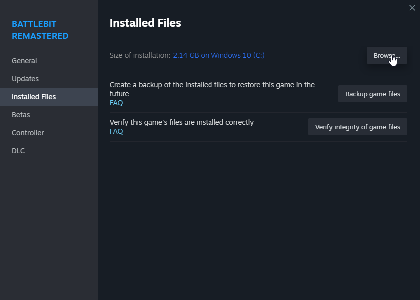
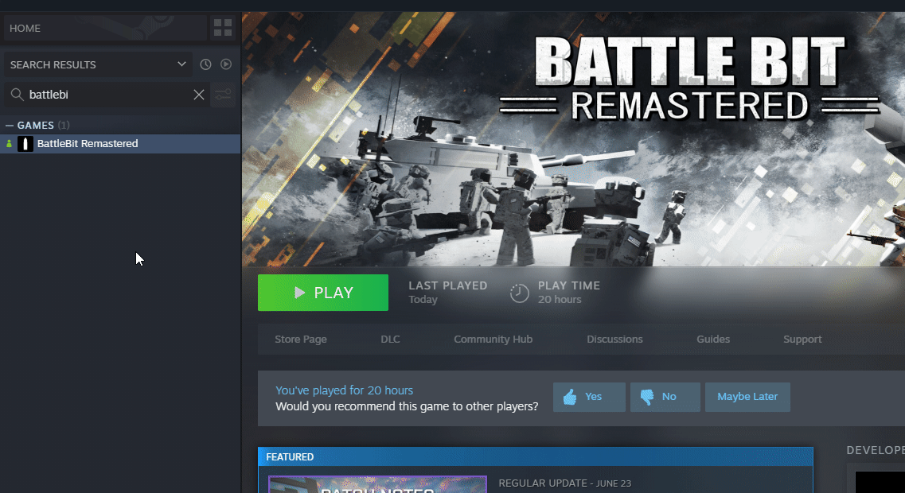

# 🔘 You were kicked by anti cheat

1. if you using custom lang file - get rid of it and you're good to go.
2. Make sure that you don't have EAC entries in hosts file (`etc/hosts` or `C:\Windows\System32\drivers\etc\hosts`) which was needed for some games (Star Citizen as example).
3. Run the [EAC Fix batch](https://github.com/livingflore/BattleBitEACFix) (download button).
4. Ensure that absolutely **NOTHING** blocks EAC connection (antivirus/firewall/ISP).
5. Delete `Certificates` folder in Installed Files/`EasyAntiCheat` folder and verify game files.

<figure><figcaption>
Right click on the game, then go to manage and click on Browse local files
</figcaption></figure>

<figure><figcaption>
Go to <code>EasyAntiCheat</code> folder and delete <code>Certificates</code> folder.
</figcaption></figure>

<figure><figcaption>
Right click on the game and press "Properties...", Select "Installed Files" tab and press "Verify integrity of game files".
</figcaption></figure>

6. Change your IP by restarting modem/router or use private VPN/[Cloudflare WARP](https://1.1.1.1).
7. Check recent windows updates - if there was some update and after it you started experience this issue, [roll it back](https://www.itechtics.com/rollback-windows-updates/).
