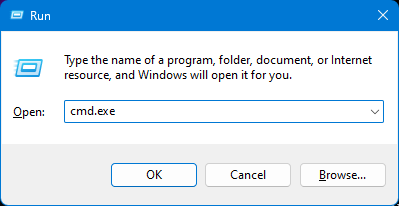
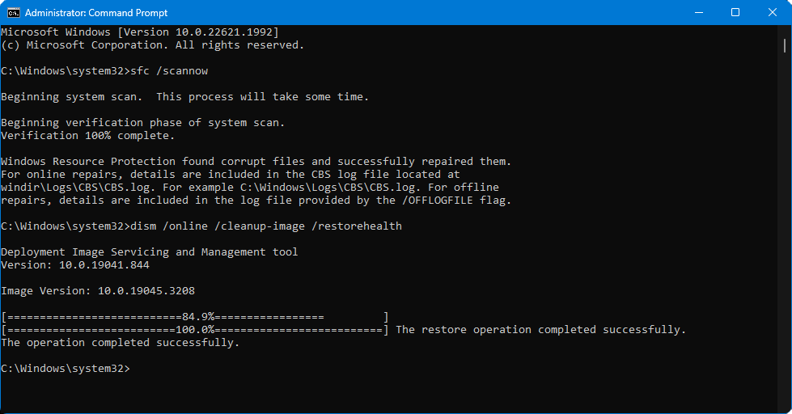

# 🔘 Running sfc/dism

1. Run command prompt as administrator.

<figure><figcaption>
Press <code>Win+R</code>, then type <code>cmd.exe</code> and <strong>press Ctrl+Shift+Enter</strong>.
</figcaption></figure>

2. Run `sfc /scannow` and after it'll finish, run `dism /online /cleanup-image /restorehealth`.

<figure><figcaption>
That's how command prompt should look after both sfc and dism finished.
</figcaption></figure>

3. After dism will finish, reboot your PC.

