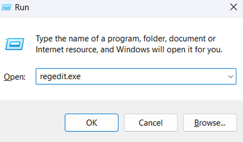
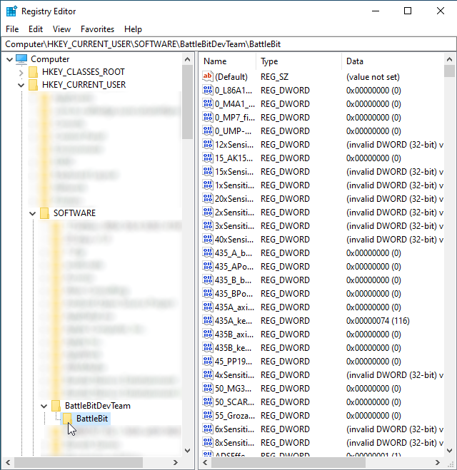
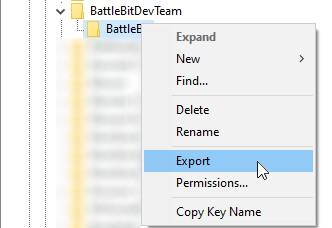

# 🔘 Saving all your keybinds in one file

1. Press Win+R, type`regedit.exe` - this will open registry editor.

<figure><figcaption></figcaption></figure>

2. Navigate to `HKEY_CURRENT_USER\SOFTWARE\BattleBitDevTeam\BattleBit`.

<figure><figcaption></figcaption></figure>

3. Right click on `BattleBit` folder and press Export.

<figure><figcaption></figcaption></figure>

4. Save this file and then run it to restore your settings (keybinds, sensitivity, etc).

